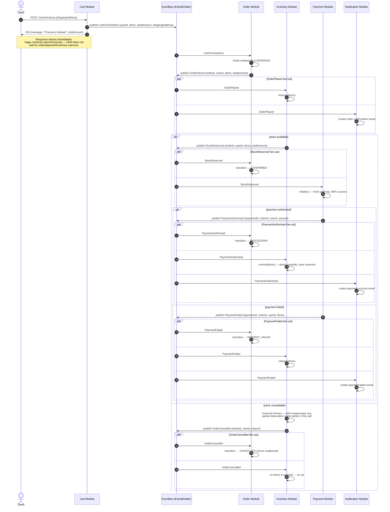

# Checkout Saga — Flow Diagram

Choreography-based saga triggered by `POST /api/v1/cart/checkout`. There is no orchestrator —
each module subscribes to the events it cares about on the in-process `eventBus`
(`server/src/shared/events/eventBus.js`) and publishes the next event itself. This mirrors the
Kafka choreography pattern used in Phase 1 (`ecommerce-platform`); the only thing that changes
on extraction to microservices is the transport (`EventEmitter` → Kafka topic).

## Event Catalog

| Event | Publisher | Subscribers |
|---|---|---|
| `CartCheckedOut` | Cart | Order |
| `OrderPlaced` | Order | Inventory, Notification |
| `StockReserved` | Inventory | Order, Payment |
| `PaymentAuthorised` | Payment | Order, Inventory, Notification |
| `PaymentFailed` | Payment | Order, Inventory, Notification |
| `OrderCancelled` | Inventory (reservation failure) or Order (`cancel` API) | Order, Inventory |

## Sequence Diagram

## Known Gaps / Open Questions

This was found while tracing the actual handlers, not the happy-path description in the
README. Flagging rather than fixing, per architecture-before-code discipline:

1. **No durability.** Events live only in the in-process `EventEmitter`. A process crash
   mid-saga silently drops in-flight events with no retry or replay — contrast with Phase 1,
   where Kafka consumer offsets allow redelivery.

### Fixed

~~No compensation on `PaymentFailed`~~ — `payment.service.js` threads `items` through from
the `StockReserved` payload into the `PaymentFailed` payload, and `inventory.events.js`
subscribes to `PaymentFailed` to release reserved stock.

~~`OrderCancelled` handler shared by two unrelated triggers~~ — `inventoryService.reserve()`
is now self-compensating: it tracks what it reserves item-by-item and rolls back that subset
if a later item in the same call fails, so it never leaves a partial reservation behind. The
reservation-failure path's `OrderCancelled` publish no longer includes `items`, so Inventory's
`OrderCancelled` subscriber correctly no-ops for that path — `items` on this event now only
ever means "real, fully-reserved stock to release" (the genuine `Order.cancel()` path).

~~Stock commit on `PaymentAuthorised` is a stub~~ — `payment.service.js` includes `items` in
the `PaymentAuthorised` payload, and `inventory.events.js` calls the existing
`inventoryService.commit(items)` to deduct quantity and clear the reservation hold.

All three are covered by `server/src/__tests__/sagas/checkout-saga.test.js`.
