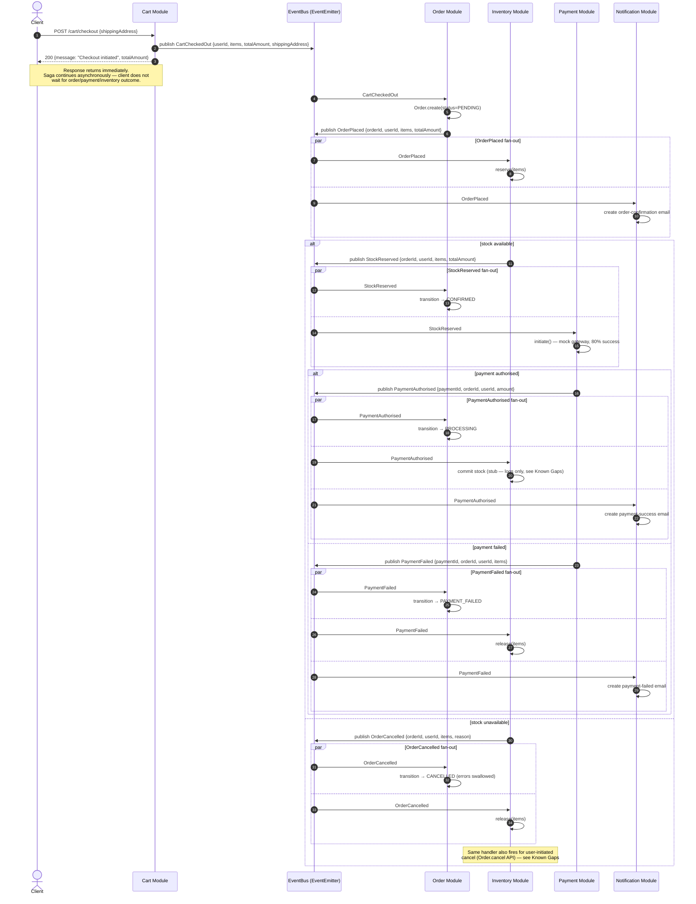

# Checkout Saga — Flow Diagram

Choreography-based saga triggered by `POST /api/v1/cart/checkout`. There is no orchestrator —
each module subscribes to the events it cares about on the in-process `eventBus`
(`server/src/shared/events/eventBus.js`) and publishes the next event itself. This mirrors the
Kafka choreography pattern used in Phase 1 (`ecommerce-platform`); the only thing that changes
on extraction to microservices is the transport (`EventEmitter` → Kafka topic).

## Event Catalog

| Event | Publisher | Subscribers |
|---|---|---|
| `CartCheckedOut` | Cart | Order |
| `OrderPlaced` | Order | Inventory, Notification |
| `StockReserved` | Inventory | Order, Payment |
| `PaymentAuthorised` | Payment | Order, Inventory, Notification |
| `PaymentFailed` | Payment | Order, Inventory, Notification |
| `OrderCancelled` | Inventory (reservation failure) or Order (`cancel` API) | Order, Inventory |

## Sequence Diagram

## Known Gaps / Open Questions

These were found while tracing the actual handlers, not the happy-path description in the
README. Flagging rather than fixing, per architecture-before-code discipline, except where noted:

1. **`OrderCancelled` handler is shared by two unrelated triggers.** Inventory's
   reservation-failure path publishes `OrderCancelled` and then its *own* subscriber calls
   `release(items)` on stock that was never successfully reserved (since `reserve()` threw).
   This is indistinguishable from the user-initiated `Order.cancel()` path, which legitimately
   needs a release. Risk of crediting phantom stock back.
2. **Stock commit on `PaymentAuthorised` is a stub.** `inventory.events.js` only logs
   `Committing stock for order ${orderId}` — the reserved quantity is never actually deducted
   from the product's stock record.
3. **No durability.** Events live only in the in-process `EventEmitter`. A process crash
   mid-saga silently drops in-flight events with no retry or replay — contrast with Phase 1,
   where Kafka consumer offsets allow redelivery.

~~No compensation on `PaymentFailed`~~ — fixed: `payment.service.js` now threads `items`
through from the `StockReserved` payload into the `PaymentFailed` payload, and
`inventory.events.js` subscribes to `PaymentFailed` to release reserved stock. Covered by
`server/src/__tests__/sagas/checkout-saga.test.js`.
